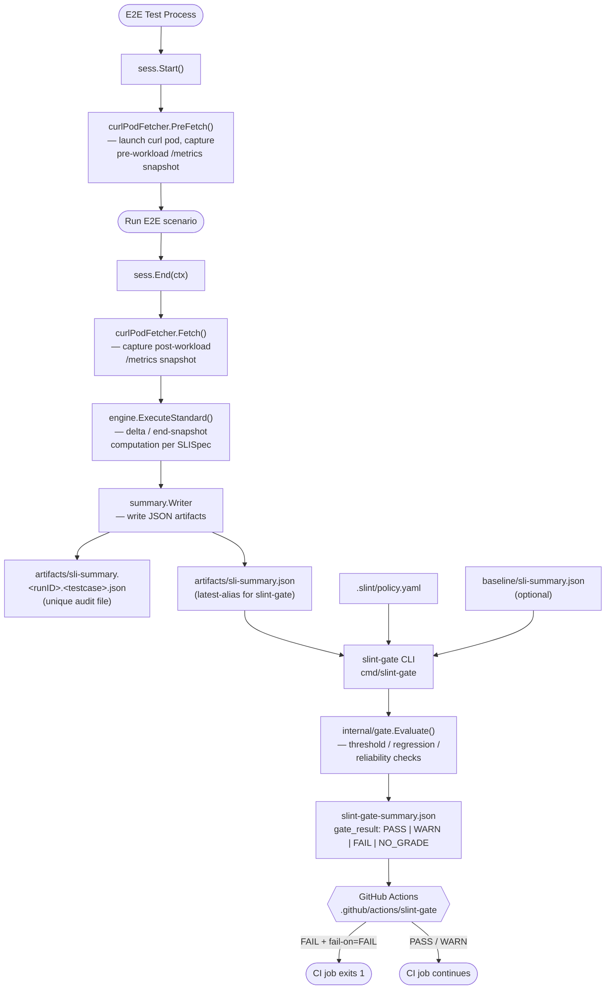

# kube-slint Architecture

## Overview

kube-slint is an embeddable Go library and CLI toolchain that attaches to Kubernetes operator E2E test sessions to collect operational SLI metrics and gate CI based on a declarative policy. It does not modify operator code, does not run as a standalone process in production, and does not replace a monitoring system. Its scope is a single test run.

---

## Data Flow



### Step-by-step description

| Step | What happens |
|---|---|
| `sess.Start()` | Records the measurement window start time. If the fetcher implements `fetch.SnapshotFetcher`, `PreFetch()` is called to launch a curl pod and cache the pre-workload `/metrics` snapshot in memory. |
| E2E scenario | The caller runs the actual test workload. kube-slint is idle during this phase. |
| `sess.End(ctx)` | Launches a second curl pod to collect the post-workload snapshot. Passes both snapshots to `engine.ExecuteStandard()` for per-SLI delta or end-snapshot computation. Writes two JSON files (see Output Files). |
| `slint-gate` CLI | Reads `sli-summary.json`, `policy.yaml`, and an optional `baseline`. Evaluates threshold rules, regression against baseline, and reliability. Writes `slint-gate-summary.json`. |
| GitHub Action | Reads `gate_result` from the gate summary. Exits 1 when the result meets the configured `fail-on` level. |

---

## Component Map

| Package path | Role |
|---|---|
| `pkg/slint` | Public API entry point. Re-exports `Session`, `SessionConfig`, `NewSession`, `DefaultSpecs`, `ReadServiceAccountToken`, and URL format constants. Consumers should import this package rather than `test/e2e/harness`. |
| `test/e2e/harness` | Session implementation (`sessionImpl`). Owns `Start()`, `End()`, `Cleanup()`, `AddWarning()`, config discovery (`DiscoverConfig`), and the `curlPodFetcher` that bridges the harness to `pkg/slo/fetch`. |
| `pkg/slo/spec` | Declarative SLI definition types: `SLISpec`, `MetricRef`, `ComputeSpec` (`delta` / `start` / `end`), `JudgeSpec`, `Rule`, `Op`, `Level`. No I/O, no Kubernetes dependencies. |
| `pkg/slo/engine` | SLI computation core. `Engine.Execute()` calls `Fetch()` twice (start/end), iterates over `[]SLISpec`, evaluates per-spec delta or snapshot, runs judge rules, and calls `summary.Writer`. `ensureConfidenceScore()` computes a supplementary 0.0–1.0 reliability score. |
| `pkg/slo/fetch` | `MetricsFetcher` interface (`Fetch(ctx, time) -> Sample`). `SnapshotFetcher` optional extension (`PreFetch(ctx)`). `InsideSnapshotFetch` utility. No Kubernetes dependencies at the interface level. |
| `pkg/slo/fetch/curlpod` | (imported by harness) Executes `kubectl run` / `kubectl logs` to create a one-shot curl pod, scrape the operator's `/metrics` HTTPS endpoint, and return raw Prometheus text. |
| `pkg/slo/fetch/promtext` | Parses Prometheus text-format exposition into `map[string]float64`. Used by `curlPodFetcher.parsePrometheusText()`. |
| `pkg/slo/summary` | Output schema types: `Summary`, `SLIResult`, `Reliability`, `RunConfig`, `Status`. `Writer` interface (`Write(path, Summary)`). `JSONFileWriter` default implementation. |
| `internal/gate` | Policy evaluation. `Evaluate(Request)` loads policy + measurement + baseline, runs threshold checks (`runThresholds`), regression checks (`runRegression`), and reliability checks (`runReliability`). Returns a `gate.Summary` written to `slint-gate-summary.json`. |
| `cmd/slint-gate` | CLI entry point. Parses flags (`--measurement-summary`, `--policy`, `--baseline`, `--output`, `--fail-on`, `--github-step-summary`), calls `gate.Evaluate()`, writes output, optionally renders `$GITHUB_STEP_SUMMARY` markdown, and exits with code 1 if `shouldFailOn()` returns true. Subcommand `slint-gate init` scaffolds `.slint/policy.yaml`. |
| `.github/actions/slint-gate` | GitHub Composite Action. Runs `go run ./cmd/slint-gate` with action inputs, uploads `slint-gate-summary.json` as a workflow artifact, exposes outputs (`gate-result`, `evaluation-status`, `summary-path`), and enforces `fail-on` via a shell case statement. |
| `pkg/kubeutil` | Cluster utilities: `ReadServiceAccountToken`, `WaitForReady`, `PollUntil`, RBAC scaffolding (`--emit-rbac`), Prometheus Operator helpers. |
| `pkg/devutil` | Development helpers: project root detection, template rendering, patch utilities. |

---

## Output Files

```
artifacts/
  sli-summary.<runID>.<testcase>.json   # unique audit file, written by sess.End()
  sli-summary.json                      # latest-alias, overwritten each run

slint-gate-summary.json                 # gate evaluation result, written by slint-gate CLI
```

`sli-summary.json` schema (abbreviated):

```json
{
  "schemaVersion": "slo.v3",
  "generatedAt": "...",
  "config": { "runId": "...", "startedAt": "...", "finishedAt": "..." },
  "reliability": {
    "collectionStatus": "Complete",
    "confidenceScore": 1.0
  },
  "results": [
    { "id": "reconcile_total_delta", "value": 42, "status": "pass" },
    { "id": "workqueue_depth_end",   "value": 0,  "status": "pass" }
  ]
}
```

`slint-gate-summary.json` schema (abbreviated):

```json
{
  "schema_version": "slint.gate.v1",
  "gate_result": "PASS",
  "evaluation_status": "evaluated",
  "checks": [
    { "name": "reconcile-activity", "category": "threshold", "status": "pass" }
  ]
}
```

---

## Design Rationale

### Why curl pod instead of in-process HTTP or port-forward?

The curl pod approach is the only method that works without modifying operator code, without privileged network access from the test process, and without requiring a running Prometheus stack. A temporary pod is created inside the cluster, issues a single HTTPS request to the operator's Service, and is garbage-collected. The test process never opens a network connection to the cluster's internal network directly.

Two alternatives were evaluated:

- **In-process HTTP fetch**: requires the test process to reach the operator Service IP directly, which is not possible from outside the cluster in most CI environments.
- **Port-forward (`kubectl port-forward`)**: works but requires a long-lived background process, introduces teardown complexity, and is slower to set up than a one-shot pod.

The curl pod is stateless and disposable: if it fails, the measurement is recorded as unmeasured and the test continues. This matches the non-fatal measurement principle.

The `SnapshotFetcher` extension (`PreFetch` / cached first `Fetch`) was added to solve a specific timing gap: because curl pods always return the current state of `/metrics` rather than a historical snapshot, calling `Fetch()` twice inside `End()` would return identical post-workload values and produce delta = 0. `PreFetch` in `Start()` captures the pre-workload state and caches it so the first `Fetch()` in `engine.Execute()` returns the correct baseline.

### Non-fatal measurement failure

kube-slint is strictly observational. Any failure during scraping — curl pod failure, Prometheus text parse error, write error — is recorded in the `Reliability` section of `sli-summary.json` and logged as a warning. The test session continues and returns a non-nil `Summary` even when collection fails.

This principle is encoded throughout the codebase:

- `engine.Execute()` returns an empty `Summary` with `CollectionStatus: "Failed"` rather than returning an error that would abort the session.
- `sess.Start()` prints a warning and continues if `PreFetch()` fails.
- The static alias write (`sli-summary.json`) is non-fatal: a write error is logged but does not propagate.

The intent is that an instrumentation problem should never block a correctness test.

### Dual-write strategy

`sess.End()` writes two files:

1. A **unique file** (`sli-summary.<runID>.<testcase>.json`) that is never overwritten. This preserves the full audit trail when multiple test cases run in the same artifacts directory.
2. A **static alias** (`sli-summary.json`) that is always overwritten with the latest result. This is the default input path for `slint-gate`, so a single-test workflow works with zero configuration.

When running parallel or multi-test suites, pass `--measurement-summary <unique-path>` to `slint-gate` to target a specific run rather than the alias.

### No controller-runtime dependency

`go.mod` does not import `sigs.k8s.io/controller-runtime`. The library works with any operator whose `/metrics` endpoint emits standard controller-runtime Prometheus metrics. This keeps the dependency footprint minimal and avoids version conflicts with the operator under test.

### Policy evaluation is separate from measurement

The `slint-gate` CLI is a standalone binary, not embedded in the harness. This separation means:

- Measurement can succeed even if policy evaluation would fail.
- Policy files can be updated and re-evaluated against stored artifacts without re-running tests.
- The gate step can be skipped entirely in environments where only measurement (not gating) is wanted.
