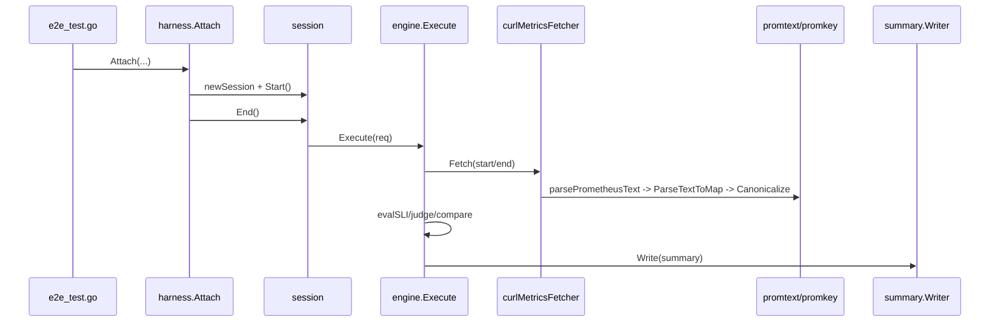

## 0) Quick orientation
- This document traces the real SLO/SLI instrumentation path used by the e2e Ginkgo suite, from `test/e2e/e2e_test.go` through `test/e2e/harness` into `pkg/slo`.
- Artifacts are written only when instrumentation is enabled and `ArtifactsDir` is non-empty; even then, writer errors can prevent the file from appearing.
- Artifact naming is assembled in `test/e2e/harness/attach.go:109-115` using `sli-summary.v3.<run_id>.<test_case>.json` with sanitization; write is skipped if `ArtifactsDir` is empty.

## 1) Entry point (exact)
- Selected entrypoint file: `test/e2e/e2e_test.go`.
- Exact instrumentation start block (15 lines):
```go
151	harness.Attach(
152		func() harness.HarnessDeps {
153			return harness.HarnessDeps{
154				ArtifactsDir: cfg.ArtifactsDir,
155				Suite:        "e2e",
156				TestCase:     "",
157				RunID:        cfg.RunID,
158				Enabled:      cfg.Enabled,
159			}
160		},
161		func() harness.FetchDeps {
162			return harness.FetchDeps{
163				Namespace:          namespace,
164				Token:              token,
165				MetricsServiceName: metricsServiceName,
```
`test/e2e/e2e_test.go:151-165`
- Enabled/ArtifactsDir/RunID/TestCase sources:
  - `cfg.Enabled` from env `SLOLAB_ENABLED` → `test/e2e/internal/env/load.go:11-16`.
  - `cfg.ArtifactsDir` from env `ARTIFACTS_DIR` → `test/e2e/internal/env/load.go:15`.
  - `cfg.RunID` from env `CI_RUN_ID` → `test/e2e/internal/env/load.go:16`.
  - `TestCase` auto-filled from Ginkgo leaf node when empty → `test/e2e/harness/attach.go:68-71`.

## 2) Main call-chain map (real execution path)
1) `e2e_test.go:151` → `harness.Attach` (`test/e2e/harness/attach.go:54`)
2) `Attach.BeforeEach` → `specsProvider` (`attach.go:73`) → `DefaultV3Specs` (`presets.go:7`) → `BaselineV3Specs` (`presets.go:13`)
3) `BaselineV3Specs` → `spec.PromMetric` (`pkg/slo/spec/spec.go:22`) → `promkey.Format` (`pkg/slo/common/promkey/promkey.go:45`)
4) `Attach.BeforeEach` → `newSession` (`attach.go:80 → 105`) → `SanitizeFilename` (`sanitize.go:6`)
5) `newSession` → `engine.New` (`attach.go:124 → pkg/slo/engine/engine.go:27`)
6) `Attach.BeforeEach` → `session.Start` (`attach.go:81 → 144`)
7) `Attach.AfterEach` → `session.End` (`attach.go:88 → 148`)
8) `session.End` → `engine.Execute` (`attach.go:151 → engine.go:35`)
9) `engine.Execute` → `fetcher.Fetch` (`engine.go:42,49 → attach.go:174`)
10) `fetcher.Fetch` → `RunCurlMetricsOnce/WaitCurlMetricsDone/CurlMetricsLogs/DeletePodNoWait` adapters (`attach.go:177-191` → `test/e2e/e2e_test.go:172-190`) → `curlmetrics.Client.*` (summarized below)
11) `fetcher.Fetch` → `parsePrometheusText` (`attach.go:195 → 206`)
12) `parsePrometheusText` → `promtext.ParseTextToMap` (`pkg/slo/fetch/promtext/parse.go:23`) → `promkey.Canonicalize/Parse/parseLabels/UnescapeLabelValue/Format` (`pkg/slo/common/promkey/promkey.go:17,81,171,45`)
13) `engine.Execute` → `evalSLI` (`engine.go:85 → 113`) → `judge` (`engine.go:170 → 177`) → `compare` (`engine.go:181 → 199`)
14) `engine.Execute` → `summary.Writer.Write` (`engine.go:89 → pkg/slo/summary/writer.go:11`) → `writeJSONAtomic` (`writer.go:30`)

Outside pkg/slo (summarized only):
- `test/e2e/curlmetrics.Client.RunOnce/WaitDone/Logs/DeletePodNoWait` create and manage a curl pod to scrape `/metrics`, fetch logs, and delete the pod (kubectl/cluster IO).

## 3) Engine.Execute contract (strict)
### Branches B1–B5 (all exit paths)
- B1: invalid timestamps
  - Trigger: `StartedAt` or `FinishedAt` is zero (`pkg/slo/engine/engine.go:37-38`)
  - Return: `summary=nil`, `error!=nil`
  - Warnings/results: none
  - Writer: not called
  - Observability: no logs/warnings
- B2: fetch(start) fails
  - Trigger: `e.fetcher.Fetch(ctx, cfg.StartedAt)` error (`engine.go:42-47`)
  - Return: `summary!=nil`, `error==nil`
  - Warnings/results: `warnings=["fetch(start) failed: ..."]`, `results=[]`
  - Writer: called with `req.OutPath`, errors ignored
  - Observability: warnings only
- B3: fetch(end) fails
  - Trigger: `e.fetcher.Fetch(ctx, cfg.FinishedAt)` error (`engine.go:49-53`)
  - Return: `summary!=nil`, `error==nil`
  - Warnings/results: `warnings=["fetch(end) failed: ..."]`, `results=[]`
  - Writer: called with `req.OutPath`, errors ignored
  - Observability: warnings only
- B4: writer error on normal path
  - Trigger: `writer.Write(req.OutPath, sum)` error (`engine.go:89-90`)
  - Return: `summary=nil`, `error!=nil`
  - Warnings/results: none
  - Writer: called, failed
  - Observability: error only
- B5: success
  - Trigger: no errors
  - Return: `summary!=nil`, `error==nil`
  - Warnings/results: warnings empty; results populated
  - Writer: called
  - Observability: none

### Decision table
Condition → Return (summary/error) → Warnings/Results → Writer called? → Notes
- Missing timestamps → `(nil, err)` → none → no → hard fail
- Fetch(start) error → `(sum, nil)` → warnings set, results empty → yes → writer errors ignored
- Fetch(end) error → `(sum, nil)` → warnings set, results empty → yes → writer errors ignored
- Writer error (normal path) → `(nil, err)` → none → yes (failed) → hard fail
- All ok → `(sum, nil)` → results populated → yes → success

### Caller checklist
- Treat `sum.Warnings` as degraded measurement even if `err == nil`.
- `err != nil` or `sum == nil` implies hard failure (B1/B4) with no summary.
- Do not assume artifact exists when `err == nil`; B2/B3 ignore writer errors.

## 4) Method cards (chain steps)
### `harness.Attach`
- Location: `test/e2e/harness/attach.go:54`
- Signature: `Attach(hdepsProvider, fdepsProvider, specsProvider, fns)`
- Purpose: Register Ginkgo hooks that measure SLO around each test.
- Important inputs: `Enabled`, `ArtifactsDir`, `RunID`, `Suite`, `TestCase`.
- Important outputs: session lifecycle; possible summary artifact.
- Error policy: AfterEach logs error and continues (`attach.go:88-90`).
- Side effects: Ginkgo hook registration.
- Branches: `Enabled=false` → no session; `specsProvider=nil` → empty specs.
- API shape review: orchestration; policy (enable/filename) lives here.

### `newSession`
- Location: `test/e2e/harness/attach.go:105`
- Purpose: Build engine, fetcher, writer, tags, outPath.
- Outputs: `*session` with `outPath` and `engine`.
- Branches: `ArtifactsDir` empty → noop writer + empty `outPath`.
- API shape: wiring + IO policy mixed.

### `session.Start`
- Location: `attach.go:144`
- Purpose: record start time.
- Side effects: `time.Now()`.

### `session.End`
- Location: `attach.go:148`
- Purpose: build `RunConfig`, call `engine.Execute`.
- Outputs: error only.
- Branches: none.

### `engine.Execute`
- Location: `pkg/slo/engine/engine.go:35`
- Purpose: fetch snapshots, evaluate SLIs, write summary.
- Branches: B1–B5 (see contract).
- API shape: mixed error vs warnings policy; writer errors fatal on normal path.

### `evalSLI`
- Location: `engine.go:113`
- Purpose: compute one SLI result from snapshots.
- Branches: missing inputs → skip; delta < 0 → warn; unknown mode → skip; judge rules → warn/fail.
- API shape: pure transform; policy around negative delta inlined.

### `judge` / `compare`
- Location: `engine.go:177` / `engine.go:199`
- Purpose: apply rule thresholds.
- Branches: fail dominates warn; unknown op returns false.

### `promtext.ParseTextToMap`
- Location: `pkg/slo/fetch/promtext/parse.go:23`
- Purpose: parse Prometheus text into key/value map.
- Branches: malformed key → skip line; bad float → error.

### `promkey.Canonicalize` + helpers
- Location: `pkg/slo/common/promkey/promkey.go:17,73,81,171,45`
- Purpose: canonicalize metric key with sorted labels.
- Branches: malformed labels → error.

### `summary.Writer.Write`
- Location: `pkg/slo/summary/writer.go:19`
- Purpose: write summary to disk; skip if path empty.
- Branches: `path==""` → no write.

## 5) Field provenance matrix (tables)
### Summary.*
| Field | Origin (file:line) | Value source | Branch sensitivity | Omission | Notes |
|---|---|---|---|---|---|
| schemaVersion | `pkg/slo/engine/engine.go:56-58` | constant `"slo.v3"` | B2–B5 | never | invariant when summary exists |
| generatedAt | `engine.go:58` | `time.Now()` | B2–B5 | never | set per Execute/emptySummary |
| config | `engine.go:59-70` / `engine.go:99-107` | `RunConfig` from session | B2–B5 | never | mirrors `RunConfig` |
| results | `engine.go:73-87` / `engine.go:108` | evalSLI output / empty slice | B2–B5 | never | empty for B2/B3 |
| warnings | `engine.go:45-53` / `engine.go:109` | fetch error message | B2/B3 only | omitted if empty | only on fetch failure |

### RunConfig.* (as embedded in summary)
| Field | Origin (file:line) | Value source | Branch sensitivity | Omission | Notes |
|---|---|---|---|---|---|
| runId | `attach.go:151-154` → `engine.go:60` | env `CI_RUN_ID` | B2–B5 | omitted if empty | may be empty |
| startedAt | `attach.go:144-155` → `engine.go:61` | `time.Now()` | B2–B5 (invalid → B1) | never | must be set |
| finishedAt | `attach.go:149-155` → `engine.go:62` | `time.Now()` | B2–B5 (invalid → B1) | never | must be set |
| mode.location | `attach.go:129-131` → `engine.go:64` | `"inside"` | B2–B5 | never | fixed in v3 harness |
| mode.trigger | `attach.go:129-131` → `engine.go:65` | `"none"` | B2–B5 | never | fixed in v3 harness |
| tags | `attach.go:133-138` → `engine.go:67` | suite/test/namespace/run_id | B2–B5 | omitted if empty | TestCase auto-filled |
| format | `attach.go:151-158` → `engine.go:68` | empty string | B2–B5 | omitted if empty | v3 harness leaves empty |
| evidencePaths | `attach.go:151-158` → `engine.go:69` | nil | B2–B5 | omitted if nil | unused in v3 harness |

### SLIResult.*
| Field | Origin (file:line) | Value source | Branch sensitivity | Omission | Notes |
|---|---|---|---|---|---|
| id | `engine.go:114-115` | `spec.SLISpec.ID` | B5 only | never when result exists | required |
| title | `engine.go:115-116` | spec | B5 | omitted if empty | from presets |
| unit | `engine.go:116-117` | spec | B5 | omitted if empty | from presets |
| kind | `engine.go:117-118` | spec | B5 | omitted if empty | from presets |
| description | `engine.go:118-119` | spec | B5 | omitted if empty | from presets |
| value | `engine.go:148-168` | computed | B5 | omitted if nil | nil on skip/unknown mode |
| fields | not set | none | B5 | omitted if nil | unused in v3 path |
| status | `engine.go:120,142-172` | computed/judged | B5 | never when result exists | pass/warn/fail/skip |
| reason | `engine.go:143-166,170-172` | computed | B5 | omitted if empty | missing inputs / delta<0 / judge |
| inputsUsed | `engine.go:123-140` | spec input keys | B5 | omitted if empty | canonical keys |
| inputsMissing | `engine.go:124-145` | missing keys | B5 | omitted if empty | non-empty → skip |

### Branch-to-field delta table
| Branch | Fields present/absent | Field deltas | Writer attempted? | Error surfaced? |
|---|---|---|---|---|
| B1 | no summary | n/a | no | yes |
| B2 | summary + warnings + empty results | warnings set | yes (ignored errors) | no |
| B3 | summary + warnings + empty results | warnings set | yes (ignored errors) | no |
| B4 | no summary | n/a | yes (failed) | yes |
| B5 | summary + results | results populated | yes | no |

## 6) Artifact details (v3 + naming + conditions)
- Schema: `schemaVersion = "slo.v3"` and `generatedAt = time.Now()` set in `pkg/slo/engine/engine.go:56-58`.
- Tags: set in `test/e2e/harness/attach.go:133-138` (suite/test/namespace/run_id).
- Naming/sanitization:
  - Pattern: `sli-summary.v3.<run_id>.<test_case>.json` built in `test/e2e/harness/attach.go:109-113`.
  - Sanitization: `SanitizeFilename` replaces unsafe characters and empty → `"na"` (`test/e2e/harness/sanitize.go:6-15`).
- Computed but not written:
  - `ArtifactsDir` empty → noop writer (`attach.go:106-116`).
  - Writer error in B2/B3 is ignored (`engine.go:45-53`).
- Write attempted but missing:
  - Any writer error on B2/B3 (ignored) can leave missing file.
  - B4 (writer error) returns error and no summary.

## 7) Development style findings
### Implicit design rules
- Keep `pkg/slo` independent of external logger implementations (`pkg/slo/engine/engine.go:14-33`).
- BestEffort measurement failures return warnings, not errors (`engine.go:41-53`).
- All measurement methods converge to one summary schema (`pkg/slo/summary/schema.go`).
- Parsing is best‑effort for malformed metric lines (`pkg/slo/fetch/promtext/parse.go:38-41`).
- Artifact writes are atomic (`pkg/slo/summary/writer.go:27-71`).

### Anti-patterns / inconsistencies (>=10)
1) Mixed error vs warning semantics in `engine.Execute` (B2/B3 vs B4) `pkg/slo/engine/engine.go:42-53,89-90`.
2) Writer errors ignored on fetch-failure paths `engine.go:45-53`.
3) `Engine.logf` stored but never used `engine.go:19-33`.
4) `ComputeSingle` uses start snapshot only; preset comment hints mismatch `engine.go:150-151` vs `test/e2e/harness/presets.go:81-91`.
5) Parser skips malformed keys but hard-fails on bad floats `pkg/slo/fetch/promtext/parse.go:38-46`.
6) Unknown judge level silently ignored `engine.go:184-191`.
7) Unknown op silently returns false `engine.go:199-212`.
8) `emptySummary` drops per-spec results, losing context on which SLIs were skipped `engine.go:95-110`.
9) Aggregation of label-stripped metric names is forced (no option) `test/e2e/harness/attach.go:212-219`.
10) BestEffort policy lives in engine, not configurable per caller `engine.go:41-53`.
11) `RunConfig.Format`/`EvidencePaths` exist but unused in v3 path `engine.go:68-69`.
12) Scanner buffer not increased; long lines may truncate `pkg/slo/fetch/promtext/parse.go:25`.

### Suggested consistent alternatives
- Normalize return shape to include warnings and errors together (single Result struct).
- Decide and document a single failure policy: either all IO failures are errors or all become warnings.
- Move aggregation policy into options passed to parser/fetcher.

### Prioritized refactoring targets
1) `pkg/slo/engine/engine.go`: unify error/warning semantics and use `logf` (High impact, Medium effort).
2) `pkg/slo/fetch/promtext/parse.go`: add parser options + line-length handling (High impact, Medium effort).
3) `test/e2e/harness/attach.go`: make aggregation and output-policy configurable (Medium impact, Low effort).

## 8) v4 presence (does it participate in this suite?)
- v4 entrypoints exist (`test/e2e/harness/attach_v4.go`, `test/e2e/harness/session_v4.go`, `pkg/slo/engine/engine_v4.go`), but **they are not invoked** from `test/e2e/e2e_test.go`, which calls `harness.Attach` (v3) at `test/e2e/e2e_test.go:151`.
- High-level differences:
  - v4 uses `AttachV4` and `SessionV4` with auto-tags and `NextSummaryPath` for collision handling (`session_v4.go:72-120`).
  - v4 calls `engine.ExecuteV4` which sets `RunConfig.Format` and maps measurement method to `RunMode` (`engine_v4.go:19-32`).
  - v4 still delegates to v3 engine for evaluation but with `Format="v4"`.

## 9) Mermaid sequence diagram (one)

